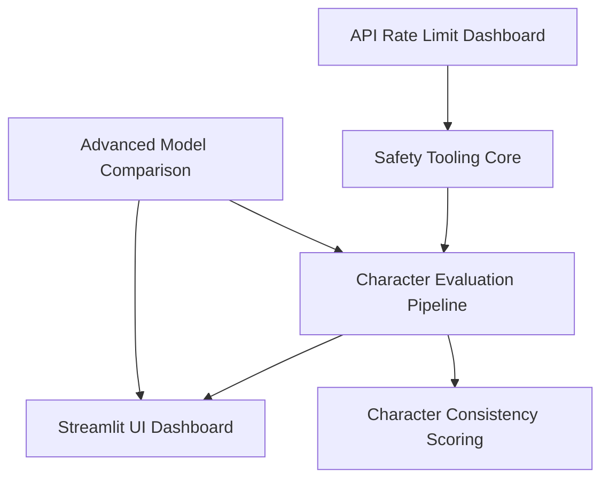

# Feature Index

This document tracks all features in development, planned, and completed within the character training repository.

## Active Development

| Feature Name | PRD Document | Status | Owner | Started | Target Launch |
|--------------|--------------|--------|-------|---------|---------------|
| *No active features* | - | - | - | - | - |

## Planning Phase

| Feature Name | PRD Document | Status | Owner | Expected Start |
|--------------|--------------|--------|-------|----------------|
| *No features in planning* | - | - | - | - |

## Completed Features

| Feature Name | PRD Document | Completed | Owner | Launch Notes |
|--------------|--------------|-----------|-------|--------------|
| Safety Tooling Core | - | Existing | Team | Core LLM inference library |
| Character Evaluation Pipeline | - | Existing | Team | End-to-end evaluation system |
| Streamlit UI Dashboard | - | Existing | Team | Three-tab interface for analysis |

## Backlog

| Feature Name | Priority | Description | Estimated Size |
|--------------|----------|-------------|----------------|
| Advanced Model Comparison | High | Enhanced comparison dashboard with statistical analysis | Large |
| Automated Report Generation | Medium | Generate PDF reports from evaluation results | Medium |
| API Rate Limit Dashboard | Medium | Real-time monitoring of API usage across providers | Medium |
| Character Consistency Scoring | High | Improved algorithms for measuring character trait consistency | Large |
| Batch Evaluation Processing | Low | Process multiple evaluation sets in parallel | Small |
| Integration Test Suite | Medium | Comprehensive integration testing framework | Medium |

## Feature Categories

### Core Infrastructure
- **Safety Tooling**: LLM API integrations, caching, rate limiting
- **Database Systems**: SQLite schemas, data models, migrations
- **Testing Framework**: Unit, integration, and end-to-end testing

### Evaluation & Analysis
- **Pipeline Components**: Idea generation, context building, conversation creation
- **Judgment Systems**: Single scoring, ELO comparison, consistency analysis
- **Visualization**: Charts, graphs, comparative analysis dashboards

### User Experience
- **Streamlit Applications**: Interactive dashboards and chat interfaces
- **Command Line Tools**: Automation scripts and batch processing
- **Documentation**: User guides, API documentation, troubleshooting

### Research Tools
- **Character Science**: Consistency analysis, trait measurement
- **Data Generation**: Synthetic evaluation data, prompt variation
- **Model Comparison**: Cross-provider performance analysis

## Feature Request Process

### 1. Submit Feature Proposal
Create a brief proposal following this format:
```markdown
## Feature Proposal: [Name]
**Problem**: What user problem does this solve?
**Solution**: High-level approach to solving it
**Impact**: Why is this important now?
**Scope**: Rough estimate of complexity (Small/Medium/Large)
```

### 2. PRD Development
If approved, create detailed PRD using `PRD_TEMPLATE.md`:
- Copy template to `FEATURE_[NAME].md`
- Complete all sections with specifications
- Get stakeholder review and approval

### 3. Implementation
Follow development process in `DEVELOPMENT_PROCESS.md`:
- Technical design review
- Sprint planning and execution
- Testing and quality assurance
- Launch and post-launch review

## Status Definitions

### Development Statuses
- **Planning**: PRD in development, not yet approved
- **Approved**: PRD approved, waiting for development resources
- **In Progress**: Active development underway
- **Testing**: Feature complete, undergoing QA testing
- **Launch Prep**: Ready for deployment, final preparations
- **Launched**: Live in production, monitoring initial metrics
- **Complete**: Fully delivered, success metrics achieved

### Priority Levels
- **Critical**: Blocking other work or addressing urgent user needs
- **High**: Important for user experience or business objectives
- **Medium**: Valuable enhancement but not time-sensitive
- **Low**: Nice-to-have improvement for future consideration

### Size Estimates
- **Small**: 1-2 weeks, single developer, minimal integration
- **Medium**: 2-4 weeks, 1-2 developers, moderate complexity
- **Large**: 4+ weeks, multiple developers, significant integration

## Integration Tracking

### Cross-Feature Dependencies
Features that depend on or enable other features:



### System Impact Assessment
Each feature is evaluated for impact on:
- **Performance**: System speed and resource usage
- **Reliability**: Overall system stability
- **Maintainability**: Code complexity and technical debt
- **User Experience**: Interface and workflow improvements
- **Security**: Data protection and access control

## Metrics and Success Tracking

### Feature Success Metrics
Common metrics across features:
- **Adoption Rate**: Percentage of users utilizing the feature
- **Performance Impact**: System performance before/after launch
- **User Satisfaction**: Feedback scores and usage patterns
- **Business Value**: Achievement of stated PRD objectives

### Development Metrics
Process improvement tracking:
- **Time to Market**: PRD approval to production launch
- **Quality**: Post-launch bug rate and severity
- **Scope Management**: Features delivered vs. originally planned
- **Resource Efficiency**: Actual vs. estimated development effort

## Roadmap Planning

### Current Quarter Focus
Priorities for ongoing development based on user needs and business objectives.

### Next Quarter Pipeline
Features moving from backlog to active development.

### Future Vision
Long-term strategic features that support overall product direction.

---

## Maintenance

**Document Owner**: Engineering Team
**Update Frequency**: Weekly during active development, monthly for planning
**Last Updated**: [Current Date]

**Contributing**:
- Add new feature proposals to backlog section
- Update status changes weekly
- Archive completed features quarterly
- Review and prioritize backlog monthly