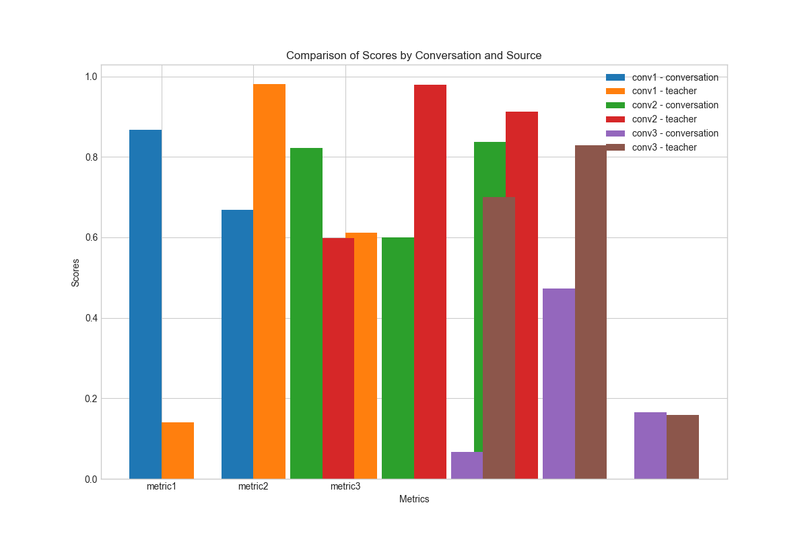

# Character Training

This repository contains the code for training and evaluating AI characters.

## Webapp

To browse and inspect conversation JSON files, you can use the webapp located in `evals/webapp`.

### Setup

1.  Install Flask:
    ```bash
    pip install flask
    ```

2.  Navigate to the webapp directory:
    ```bash
    cd evals/webapp
    ```

3.  Start the Flask development server:
    ```bash
    python app.py
    ```

4.  Open your browser and go to:
    ```
    http://localhost:8555
    ```

### Screenshot


## vLLM Support

The system now supports self-hosted vLLM models with automatic fallback to OpenRouter:

- Use HuggingFace model IDs directly: `model="org/model-name"`
- Automatic thinking/reasoning support
- Graceful fallback to OpenRouter if vLLM unavailable
- Full tool calling support maintained

Example:
```python
chatter = ModelChatter(model="stewy33/my-model")
response = await chatter.chat("Hello!")
```

## Generating Comparison Plot

To generate a plot comparing the scores from the `tidy_data.csv` file, run the following command:

```bash
python plot_comparison.py
```

This will generate a file named `comparison.png` that looks like this:



